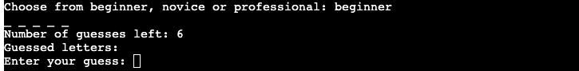
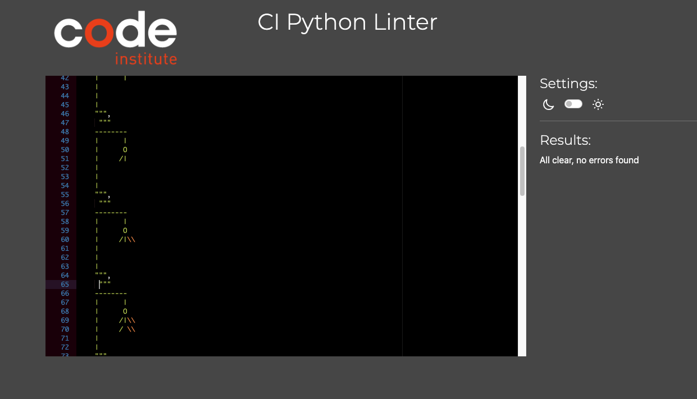

# Welcome To Hangman!

This is my 3rd project for the Code Institute Full Stack Software Engineering program. 

You can find the live version of the site here [here](https://hangman0000-3387183dc1ef.herokuapp.com/).

At the time of development I was still pretty new to Python so this project was pretty challenging at times. But I definitely
found it alot easier to handle than JavaScript. I started off putting together the pieces that I was comfortable with. The word bank contains words which are relative to programming which is a little hint for potential players! 

# Stages Of The Program / Color Code

- This is the landing screen, where the user can start the game and pick a difficulty. 

- The game features a simple layout, the "_" indicate how many letters are in the word, there's a counter for number of guesses left, the program will also show you the letters already guessed and it has an input field for entering a single letter. 

- I've set up the program to print colored messages for ease of readability.

- There is error messages for the following inputs: 

<ol>
<li>Red: for selecting a difficulty which isn't available.</li>
<li>Blue: for selecting more than one letter and for runninf out of guesses.</li>
<li>Yellow: for selecting a letter which has already been chosen.</li>
<li>Green: for guessing the correct word.</li>
</ol> 

# Technologies Used 

- Python 

- [Python Linter](https://pep8ci.herokuapp.com/)

- [PythonTutor](https://pythontutor.com/)

- [PyPi](https://pypi.org/project/art/s)

# How To Play 

- Hangman is a classic guessing game. 

- The first thing to do is select a difficulty from the options provided.

- Secondly, pick a letter and see does it fit the word in question. 

- You will have six guesses for each difficulty. 

- Each guess must be a single letter. 

- Find out how you did after all your guesses are used up. 

- If you guess the correct letter then your number of guesses doesn't decrease! 

# Features 

- Select from different difficulties (beginner, novice, professional).

- The user will have the option to start the game again at the end by selecting "y" or "n" for yes and no respectively.

# User Stories 

- As a new site user, I would like to play the Hangman game. 

- As a new site user, I like to select different difficulties. 

- As a new site user, I would like to see how many guesses I have left. 

# Key Project Goals 

- I want to make a Hangman Python program which also incorporates object-oriented programming (OOP) concepts.

- I want the program to be user friendly and easy to understand. 

- I want the program to have color coded feedback messages for easier readability. 

# Validations / Testing 

- My Python code pass through the linter with no issues. 

- I tested my project on Google Chrome and Mozilla Firefox and it works perfectly. 

- I deployed the project to Heroku and the deployment went smoothly. (See below for deployment steps).

- The project works exacly as intended. All print statements display correctly and I didn't encounter any bugs. 

# Deployment 

- This was my first time using Heroku to deploy a project. **The steps are as follows:**

1. Create a Heroku account. 

2. Create a new app. 

3. Give the app a unique name and select your region from the options. 

4. Connect to GitHub (you may be asked to login).

5. Select which branch you want to deploy from. 

6. Deploy the project. 

- Heroku would be more suitable for backend development which is why it's preferred over GitHub pages for this particular 
project.

# Bugs 

- At the beginning of development, I had some minor issues with deploying. I fixed it by removing a dependancy from
my requirements.txt. 

# Credits 

- My mentor Spencer, for his constant guidance and reassurance. 

- My colleague and friend, Katherine, for testing out the program and making sure it worked. 

- My brother Sean, for testing out the program and making sure it worked.

- Code Institute for the project template and deployment terminal. 

- I used various different tutorials throughout the project.

- [Stack Overflow](https://stackoverflow.com/)

[Tutorial 1](https://www.youtube.com/watch?v=pFvSb7cb_Us)

[Tutorial 2](https://www.youtube.com/watch?v=m4nEnsavl6w)

[Tutorial 3](https://www.youtube.com/watch?v=5x6iAKdJB6U)

- I found the lessons and challenges in the Code Institute really helpful and found it easier to put blocks of
code together than I did with JavaScript. 

- I sought further clarity on "If Elifs" using [this tutorial](https://www.w3schools.com/python/gloss_python_elif.asp#:~:text=The%20elif%20keyword%20is%20pythons,%2C%20then%20try%20this%20condition%22.).

- I used [this tutorial](https://www.w3schools.com/python/python_for_loops.asp) to enhance my learning on For Loops. 

- Further information on [While Not](https://stackoverflow.com/questions/4908666/how-to-use-while-not-in).

- I used this video for reference about my [commit messages](https://www.youtube.com/watch?v=gZ5pEPO24Uc).

- I used this [Git Cheat Sheet](https://education.github.com/git-cheat-sheet-education.pdf) for help with commands which I 
wasn't used to using or which I have never used before.

